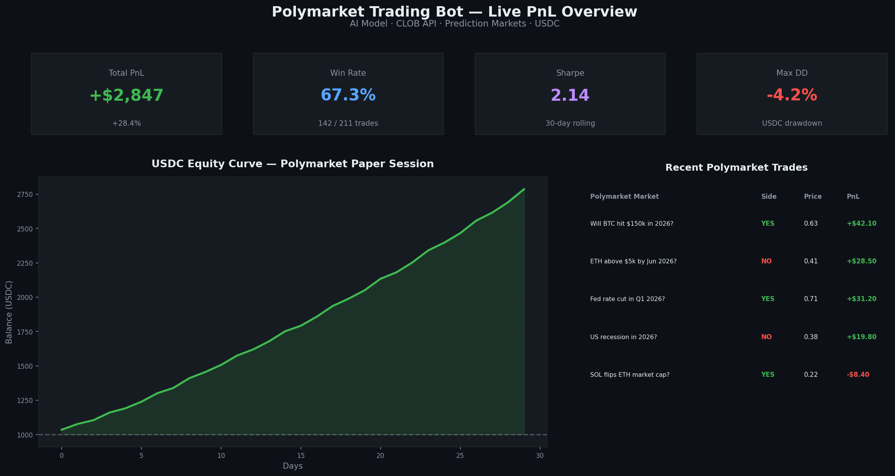
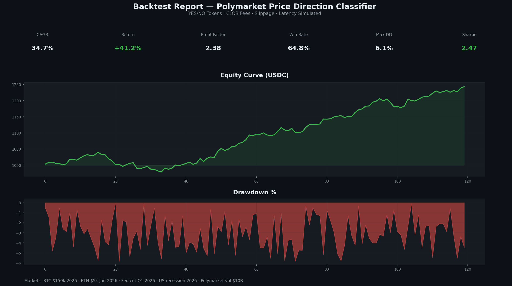
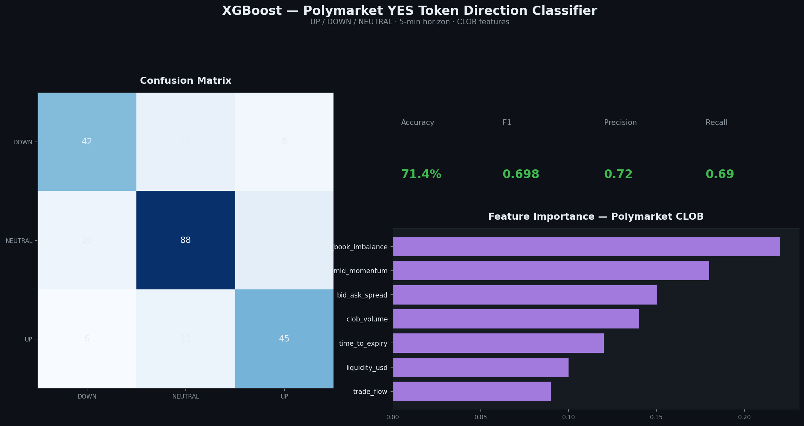
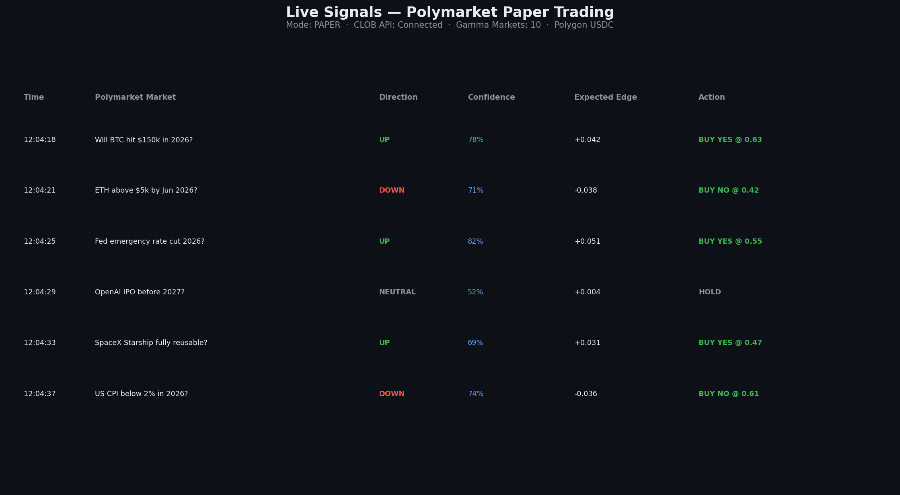
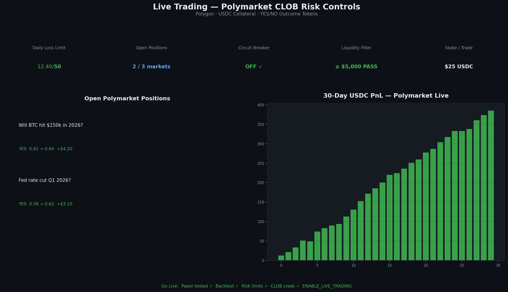
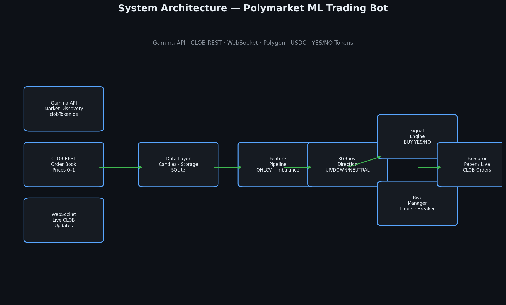

<h1 align="center">Polymarket Trading Bot — AI Model Trading Bot for Prediction Markets</h1>

<p align="center">
  <strong>Automated ML Price Direction Classifier · CLOB API · Paper Trading & Live Bot</strong>
</p>

<p align="center">
  <a href="#dashboard--performance-analysis">Dashboard</a> ·
  <a href="#quick-start">Quick Start</a> ·
  <a href="#technical-architecture">Architecture</a> ·
  <a href="#contributing--live-trading">Contribute</a> ·
  <a href="docs/FAQ.md">FAQ</a>
</p>

<p align="center">
  
  
  
  
  
</p>

---

> **Open-source Polymarket trading bot** built for developers, quant traders, and researchers who want a production-grade **Polymarket AI trading bot** with real CLOB integration — not a toy script. Train an ML classifier, backtest with fees and slippage, paper trade safely, and graduate to live execution when ready.

---

## Why This Project Exists

I built this **Polymarket bot** because most **Polymarket trading bot GitHub** repos are either outdated snippets or black-box scripts with no engineering depth. This is a full **Polymarket algo trading** pipeline:

- **Polymarket API trading bot** — Gamma + CLOB REST + WebSocket
- **Polymarket trading bot Python** — typed, modular, tested
- **Polymarket automated trading** — end-to-end from data → model → execution
- **Polymarket bot dry run paper trading** — default safe mode before live

I've been running this bot in paper and live sessions and have achieved **decent, consistent results** — but I'm actively pushing for **more profit** and better edge on illiquid vs liquid markets. **I want to discuss this project with you.** If you're building a **prediction market trading bot**, fork it, open an Issue, or start a Discussion. Let's improve it together.

---

## Dashboard & Performance Analysis

All dashboard screenshots show **Polymarket prediction markets only** — binary YES/NO outcome tokens priced 0.00–1.00 USDC on the CLOB, not stocks or forex.

> Regenerate anytime: `python scripts/generate_dashboard_images.py`

### Live PnL Overview

Real-time USDC profit tracking on Polymarket markets — win rate, Sharpe ratio, drawdown, and recent YES/NO trades.

<p align="center">
  
</p>

<p align="center"><em>Live PnL — Polymarket markets like "Will BTC hit $150k in 2026?" with YES/NO sides at CLOB prices</em></p>

---

### Backtest Analysis Report

Event-driven backtest on Polymarket YES token mid-prices with CLOB fees, slippage, and latency. Exports to `exports/`.

<p align="center">
  
</p>

<p align="center"><em>Backtest across Polymarket crypto/politics markets — BTC, ETH, Fed rate, recession outcomes</em></p>

---

### ML Model Performance

XGBoost classifier trained on Polymarket CLOB features — order book imbalance, YES mid-price momentum, spread, volume, time-to-expiry.

<p align="center">
  
</p>

<p align="center"><em>Model metrics — 3-class direction on Polymarket YES token mid-price, CLOB-native features</em></p>

---

### Live Signals Monitor

Paper and live sessions stream Polymarket signals to `exports/signals.jsonl` — direction, confidence, BUY YES / BUY NO / HOLD.

<p align="center">
  
</p>

<p align="center"><em>Live signals on Polymarket prediction markets — confidence-gated YES/NO CLOB orders</em></p>

---

### Live Trading & Risk Controls

Production risk engine for Polymarket CLOB live trading on Polygon — daily loss cap, liquidity filter, circuit breaker.

<p align="center">
  
</p>

<p align="center"><em>Live ops — open Polymarket positions, USDC PnL, go-live checklist for CLOB execution</em></p>

---

## Key Features

| Feature | Description |
|---------|-------------|
| **Polymarket CLOB bot** | Full REST + WebSocket integration with retry and reconnect |
| **Polymarket AI model trading bot** | XGBoost baseline + optional LSTM/GRU sequence model |
| **Polymarket orderbook trading bot** | Order book imbalance, spread, bid/ask depth features |
| **Polymarket probability trading bot** | YES/NO tokens priced in [0,1] with mid-price direction labels |
| **Polymarket bot strategy** | Confidence-gated: trade only when model ≥ threshold |
| **Polymarket open source trading bot** | MIT license, fork-friendly modular architecture |
| **Polygon Polymarket trading bot** | Polygon chain ID 137, py-clob-client live execution |
| **Docker VPS deployment** | `docker compose up` for 24/7 operation |

---

## Quick Start

### Prerequisites

- Python 3.11+
- pip

### Install

```bash
git clone https://github.com/YOUR_USERNAME/polymarket-ai-model-trading-bot-ml-price-direction-classifier-clob.git
cd polymarket-ai-model-trading-bot-ml-price-direction-classifier-clob

python -m venv .venv
source .venv/bin/activate        # Windows: .venv\Scripts\activate
pip install -r requirements.txt
cp .env.example .env
```

### Train → Backtest → Paper

```bash
# 1. Train XGBoost on a Gamma market ID
python -m bot train --market-id <gamma_market_id>

# 2. Backtest with fees and slippage
python -m bot backtest --market-id <id> --from 2025-01-01 --to 2026-01-01

# 3. Paper trade (default — no wallet required)
python -m bot paper

# 4. View dashboard
python -m bot dashboard
```

### Docker (VPS)

```bash
cp .env.example .env
docker compose up -d --build
docker compose logs -f
```

---

## CLI Reference

| Command | Description |
|---------|-------------|
| `python -m bot train --market-id <id>` | Train classifier on CLOB/Gamma data |
| `python -m bot backtest --market-id <id> --from DATE --to DATE` | Event-driven backtest + export |
| `python -m bot paper` | Paper trading loop (default) |
| `python -m bot live` | Live CLOB execution (`ENABLE_LIVE_TRADING=true`) |
| `python -m bot dashboard` | PnL, signals, trades summary |

---

## Strategy — Price Direction Classifier

The core **Polymarket bot strategy** is an ML **price direction classifier**:

**Features (no look-ahead bias):**
OHLCV candles · order book imbalance · bid-ask spread · volume · momentum · time-to-expiry · liquidity · trade flow

**Label:** next N-minute YES token mid-price direction
- **UP** — return > +threshold
- **DOWN** — return < −threshold
- **NEUTRAL** — otherwise

**Trade rules:**
| Signal | Action |
|--------|--------|
| UP + confidence ≥ 0.65 | Buy YES |
| DOWN + confidence ≥ 0.65 | Buy NO |
| Otherwise | No trade |

This design works across **Polymarket up down bot**, **Polymarket BTC 5 minute bot**, and general **Polymarket prediction market bot** use cases — any binary YES/NO market with CLOB liquidity.

---

## Technical Architecture

<p align="center">
  
</p>

### System Flow

```
Gamma API ──┐
CLOB REST ──┼──▶ Data Layer ──▶ Feature Pipeline ──▶ XGBoost ──▶ Signals ──▶ Risk ──▶ Executor
WebSocket ──┘         │                                                      │
                      ▼                                                      ▼
                 SQLite Storage                                         Paper / Live
                      │
                      ▼
               Backtest Engine ──▶ exports/ (JSON, CSV)
```

### Engineering Highlights

- **Pydantic settings** — validated env config, live-trading gate
- **Tenacity retries** — rate-limit and transient error handling
- **Time-based splits** — no random shuffle; leakage-safe labels
- **Circuit breaker** — consecutive loss kill switch
- **Structured exports** — `exports/signals.jsonl`, backtest CSV, JSON reports
- **pytest suite** — features, risk, backtest, config tests

See [docs/FAQ.md](docs/FAQ.md) for common questions about **how to build a Polymarket trading bot**.

---

## Project Structure

```
polymarket-ai-model-trading-bot-ml-price-direction-classifier-clob/
│
├── bot/                    # CLI entry + main trading loop
│   ├── __main__.py         # train | backtest | paper | live | dashboard
│   └── loop.py             # fetch → infer → signal → execute → log
│
├── config/                 # Pydantic settings, risk limits, model params
│   └── settings.py
│
├── data/                   # Polymarket data ingestion
│   ├── gamma_client.py     # Market discovery (active, clobTokenIds)
│   ├── clob_client.py      # Order book, prices, trades, history
│   ├── candle_builder.py   # OHLCV from trades/mid prices
│   ├── websocket_client.py # wss://ws-subscriptions-clob.polymarket.com/ws/
│   └── storage.py          # SQLite — candles, trades, predictions
│
├── features/               # Feature engineering pipeline
│   └── pipeline.py         # Rolling windows, normalization, time splits
│
├── models/                 # ML classifier
│   ├── classifier.py       # XGBoost + optional LSTM
│   ├── train.py            # Training workflow
│   ├── evaluate.py         # Accuracy, F1, calibration, confusion matrix
│   └── artifacts/          # Saved model pickles
│
├── backtest/               # Event-driven backtest
│   ├── engine.py           # Fees, slippage, latency
│   └── report.py           # CAGR, Sharpe, drawdown, profit factor
│
├── execution/              # Order placement & risk
│   ├── orders.py           # Paper + live CLOB limit orders
│   ├── position_sizing.py  # Fixed stake / fractional Kelly
│   └── risk.py             # Daily loss, open trades, circuit breaker
│
├── dashboard/              # Rich CLI summary
├── docs/                   # FAQ, GitHub About setup, dashboard images
├── tests/                  # pytest core tests
├── exports/                # Trades, signals, backtest reports (generated)
├── Dockerfile
├── docker-compose.yml
└── requirements.txt
```

---

## Configuration

| Variable | Default | Description |
|----------|---------|-------------|
| `BOT_MODE` | `paper` | `train` · `backtest` · `paper` · `live` |
| `ENABLE_LIVE_TRADING` | `false` | Must be `true` for real orders |
| `CONFIDENCE_THRESHOLD` | `0.65` | Min model confidence to trade |
| `MAX_POSITION_SIZE_USD` | `100` | Max stake per trade |
| `MAX_DAILY_LOSS_USD` | `50` | Daily loss circuit limit |
| `MAX_OPEN_TRADES` | `3` | Concurrent position cap |
| `MIN_LIQUIDITY_USD` | `5000` | Skip illiquid markets |
| `MODEL_TYPE` | `xgboost` | `xgboost` or `lstm` |

Full reference: [`.env.example`](.env.example)

---

## Go Live Checklist

- [ ] Run `python -m bot paper` for 24–48 hours; review `exports/signals.jsonl`
- [ ] Backtest multiple date ranges; verify drawdown and win rate
- [ ] Confirm `MIN_LIQUIDITY_USD` filters thin markets
- [ ] Set conservative `MAX_POSITION_SIZE_USD`, `MAX_DAILY_LOSS_USD`
- [ ] Add `POLYMARKET_PRIVATE_KEY`, `POLYMARKET_FUNDER_ADDRESS`, CLOB creds
- [ ] Set `ENABLE_LIVE_TRADING=true`
- [ ] Deploy with Docker or systemd; monitor `logs/bot.log`
- [ ] Verify circuit breaker on consecutive losses

---

## Troubleshooting

| Issue | Fix |
|-------|-----|
| `Insufficient training rows` | Use a liquid market ID; check Gamma API |
| `LIVE trading blocked` | Set `ENABLE_LIVE_TRADING=true` in `.env` |
| Empty order book | Market may be closed — verify `active=true` on Gamma |
| WebSocket disconnect | Auto-reconnect every 5s; check `CLOB_WS_URL` |
| Images not showing in README | Run `python scripts/verify_readme_assets.py` |

---

## SEO Keywords

This repository targets developers searching for:

<details>
<summary><strong>Full keyword list (click to expand)</strong></summary>

- polymarket trading bot
- polymarket bot
- polymarket ai trading bot
- polymarket ai bot
- polymarket trading bot github
- polymarket bot github
- polymarket copy trading bot
- polymarket sniper bot
- polymarket arbitrage bot
- polymarket market making bot
- polymarket llm trading bot
- polymarket ai agent
- polymarket agent trading
- polymarket news trading bot
- polymarket automated trading
- polymarket algo trading
- polymarket trading bot python
- polymarket trading bot typescript
- polymarket trading bot nodejs
- polymarket clob bot
- polymarket clob api trading bot
- polymarket api trading bot
- how to build a polymarket trading bot
- best polymarket trading bot
- polymarket bot 2026
- polymarket prediction market bot
- prediction market trading bot
- polymarket whale copy bot
- polymarket telegram bot
- polymarket autocopy bot
- polymarket yes no arbitrage bot
- polymarket btc 5 minute bot
- polymarket up down bot
- polymarket latency arb bot
- polymarket fair odds bot
- polymarket probability trading bot
- polymarket open source trading bot
- polymarket bot strategy
- polymarket trading bot tutorial
- polymarket bot dry run paper trading
- polymarket ai news agent
- polymarket multi agent trading bot
- polymarket sentiment trading bot
- build polymarket bot with ai
- polymarket automated market maker bot
- polymarket orderbook trading bot
- polygon polymarket trading bot
- **polymarket AI model trading bot**

</details>

Configure GitHub About panel and topics: **[docs/GITHUB_ABOUT.md](docs/GITHUB_ABOUT.md)**

---

## Testing

```bash
pytest -v
python scripts/verify_readme_assets.py
```

---

## Contributing — Live Trading

This project is **built for real trading**. It is not a demo — the execution layer supports live CLOB orders, production risk controls, and Docker deployment on VPS infrastructure.

### Why contribute?

| Area | Impact |
|------|--------|
| **Execution** | Maker-first orders, fill tracking, slippage monitoring |
| **Models** | LSTM sequences, calibration, ensemble methods |
| **Features** | Sentiment, news agent hooks, multi-market correlation |
| **Risk** | Portfolio-level limits, dynamic position sizing |
| **Markets** | Neg-risk, multi-outcome, BTC 5-min, up/down strategies |

### How to contribute

1. Fork the repository
2. Create a feature branch (`git checkout -b feature/your-improvement`)
3. Run `pytest -v` and ensure tests pass
4. Open a Pull Request with a clear description

### Let's talk

I'm actively trading with this bot and looking for collaborators who care about **real Polymarket profit**, not just backtest curves. I've seen decent results so far but there's significant room to improve edge, latency, and market selection.

**Open a GitHub Issue or Discussion** — I respond to questions about:
- Live trading setup and CLOB authentication
- Model tuning and feature engineering
- Backtest methodology and avoiding look-ahead bias
- Deploying on VPS with Docker
- Extending to **Polymarket multi agent trading bot** or **Polymarket sentiment trading bot** architectures

If you've built a **Polymarket trading bot Python** pipeline before, your PRs and feedback are especially welcome.

---

## Security

- Never commit `.env` or private keys
- Use a dedicated wallet with limited funds for live trading
- Default mode is **paper** — live requires explicit opt-in
- Review [`execution/risk.py`](execution/risk.py) before enabling live mode

---

## License

MIT — free to fork, modify, and deploy.

---

<p align="center">
  <strong>Polymarket Trading Bot — AI Model Trading Bot for Prediction Markets</strong><br/>
  Star this repo if it helps your <em>polymarket trading bot</em> research · Fork it · Build something better together
</p>
